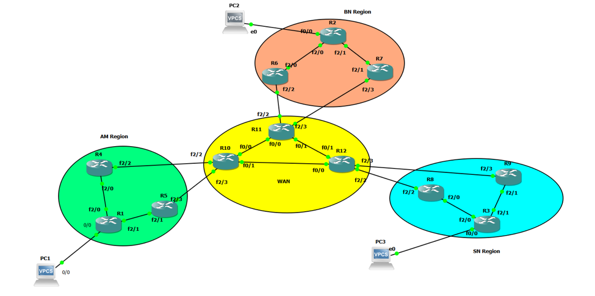
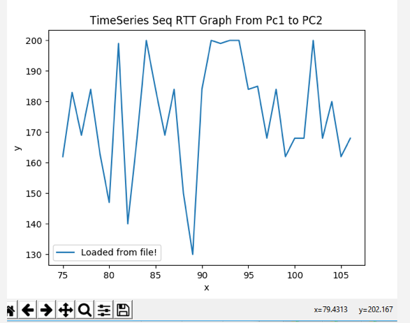

# HappyNet [happynet.io](happynet.io)


## Project for Python 300 course, part of UW PCE Python Programming certificate.

## Team: Ashay Krishna, Jing Dai, Mike Bozee


## Instructions to run locally:

- Clone this repo
- Create a virtualenv and activate:
```
$ virtualenv <name>
$ source <name>/bin/activate
```
- Install requirements:
```
$ pip install -r requirements.txt
```
- Run server:
```
$ cd network_site
$ python manage.py runserver
```
- View in browser at http://localhost:8000/


## ABOUT: Network operations automaton

Automation has been a widely-discussed topic, over the past couple years. Most network engineers are either learning automation or thinking about it.

When Ashay started his career in 2006, he was lucky to be a part of a networking project. Networking was his passion from engineering college. He always felt more comfortable in troubleshooting complex network than writing software. He is a network troubleshooter by heart and by soul.

HappyNet is the solution for engineers who are network troubleshooters at heart, bringing automation to network tasks.

The most complex part of any physical network is troubleshooting. How fast you can resolve the issue to make your customer happy.

Let’s look at the most common problems in any physical network operations, along with automated solutions.

**Problem one:** Latency and packet drop
**Manual solution:** To run traceroute and packet capture to find devices which is silently dropping packet.
**Automated solution:**



This small network in [GNS3 network simulator](https://www.gns3.com/) demonstrates the use cases. Here, we have a few customers in the European region, few in the Asian region. We want to understand proactive latency with history. If one customer complains about latency and packet loss, how you will resolve that issue?

To resolve this issue with automation, TCPSPRAY is used with customer application source port from one region to another region. The Python script are running with Jenkins at a consistent ten-minute time interval.

For storing the data in a database, we are using PostgreSQL. This allows timestamped data storage, over the past 30-day history.

Matplotlib is useful for plotting this data.

Given an agreed threshold, we can alert users via email or some other alerting mechanism. Or, this data can be plotted in another chart with red, yellow and green buttons.



This is an easy and proactive fix for latency issue. We just need couple of Linux boxes in each region, Python, Jenkins and PostgreSQL.
[Jenkins](https://jenkins.io/)
[PostgreSQL](https://www.postgresql.org/)

**Problem Two:** Device unhealthy in network
**Manual Solution:** First to find device which is unhealthy, manually log in, and fix the device.
**Automated Solution:**

Depending on vendors, devices provide syslogs when are unhealthy. Either its temperature, module faulty, or device is down.

We are collecting syslog messages from all network devices every five minutes in our database. There is a separate script, which is running and watching this databse. We do alert for warning syslogs with priority.

Most of the issues can be fixed without human intervention. For issues we are not alerting for, we are just triggering a python script to fix the issue.

Sample: Syslog %abc_4% -- Fix is reload module 4

1.  Database received this syslog at 1:02PST.
2.  Python script running from Jenkins and watching syslog every five minutes at 1:05, and received this syslog.
3.  Release the Solution for this syslog 1:05.
4.  To SSH into devices, we are using Netmiko Module https://github.com/ktbyers/netmiko
5.  Doing precheck and collecting needed information like #show tech support.
6.  Moving traffic from Device.
7.  Once there is no traffic on device, trying to reload the module. Check if error is fixed with show commands.
8.  If issue fixed, collecting post checks and exit.
9.  If issue not fixed, cut ticket to vendor support with collected information and move traffic from the device.
10. Cut an alert to the physical network operation engineer with all the information to track and work with vendor support.

**Problem three:** Link error in network
**Manual solution:** First to find which Link is unhealthy and isolate from network.
**Automated solution:**

We are running SNMP Polling with Python in Jenkins which is collecting data for error in the database.

If errors on link are crossing threshold, we release Python script which will SSH into the device and isolate the Physical link from the network.

We will cut a ticket to data center unit, and start tracking that ticket every hour.
The datacenter ticket will be with troubleshooting guidelines.

Once the ticket is resolved from the datacenter side, we will bring traffic back on the interface and resolve the ticket.