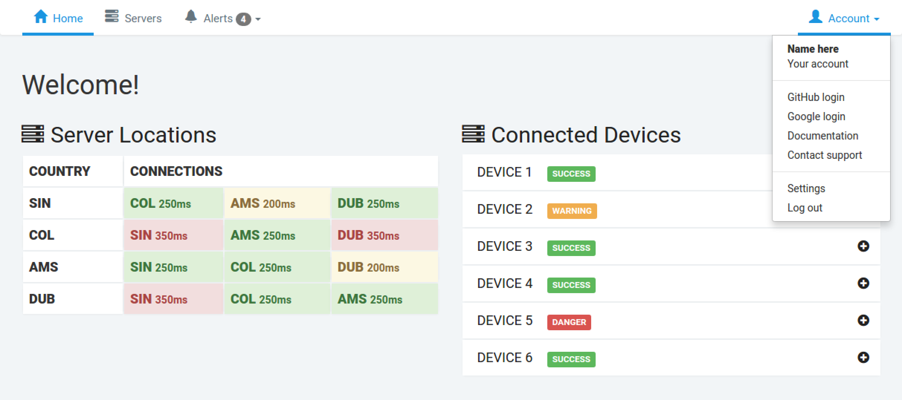

# Network Application


## Project for Python 300 course, part of UW PCE Python Programming certificate.

## Team: Ashay Krishna, Jing Dai, Mike Bozee



## Instruction to run locally:

- Clone this repo
- Create a virtualenv and activate:
```
$ virtualenv <name>
$ source <name>/bin/activate
```
- Install requirements:
```
$ pip install -r requirements.txt
```
- Run server:
```
$ cd network_site
$ python manage.py runserver
```
- View in browser at http://localhost:8000/

## Mike's Todo:

- [x] Ability to log in through GitHub/Google via allauth
- [x] Incorporate mockup UI from [static UI mockup repo](https://github.com/mikebozee/py300-network-project)
- [ ] Deploy to [AWS Elastic Beanstalk](https://aws.amazon.com/elasticbeanstalk/)
- [ ] Ability to log out of allauth account(s)
- [ ] Ability to manage site account
- [ ] Connect to GNS3 virtual networks
- [ ] Assess and manage sqlite db

## Todo:

Ashay | Jing | Mike
--- | --- | ---
Export GNS3 data to Postgres | Set up Postgres schema | Deploy to [AWS Elastic Beanstalk](https://aws.amazon.com/elasticbeanstalk/)
.. | .. | Ability to log out of allauth account(s)
.. | .. | Ability to manage site account
Connect GNS3 virtual networks to Django | Connect Postgres to GNS3 and Django | Connect Django to GNS3 virtual networks